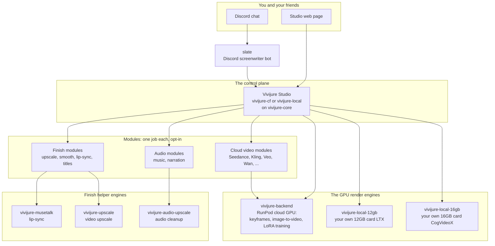

# vivijure-audio-upscale

[](https://console.runpod.io/hub/skyphusion-labs/vivijure-audio-upscale)

**Cleans up spoken dialogue so voices sound clear and full.** This is the audio cleanup finish engine
for [Vivijure](https://github.com/skyphusion-labs/vivijure), the AI film studio. It runs on a GPU
(RunPod), takes a dialogue track, and hands back a cleaner, fuller version. Under the hood it is
[resemble-enhance](https://github.com/resemble-ai/resemble-enhance) (denoise, restore, and stretch the
audio up to 44.1 kHz).

It cleans **speech only**. Music and score beds do not go through it; they take the studio's cheaper
CPU audio path instead. That is the point: only spend GPU time when there is a voice to clean. It runs
on a shot's dialogue **before** lip-sync, so the mouth follows the cleaned audio and thin auto-generated
voices come out natural.

## Where this fits

Vivijure is not one program. It is a small group of programs that work together, called the
**constellation**. The **Studio** is the center; it tells engines like this one what to do. This map
is the same in every repo, so you always know where you are.



The full map, with a plain-English walk-through, is in [docs/constellation.md](docs/constellation.md).

## Deploy this finish engine

You need a **RunPod** account (the GPU) and a **registry** to hold the image (like `ghcr.io`). Then:

```bash
cp deploy.env.example deploy.env   # then open deploy.env and fill in your keys
./deploy.sh                        # safe to re-run
```

The script builds the image, pushes it to your registry, creates the RunPod endpoint, and prints an
**endpoint id**. It is idempotent (safe to re-run) and fails closed (stops on the first error). The
full walk-through, with every setting explained, is in [docs/deploy.md](docs/deploy.md).

**Pin the right GPU.** This image is CUDA 12.8, which needs a new-driver host. Pin it to **Blackwell
(RTX PRO 6000)** or **Hopper (H100 / H200)** cards. The job is short and light on VRAM, so a
scale-to-zero endpoint on these cards still costs pennies.

## Turn it on in the studio

This engine powers the studio's **speech-upscale** module. Its endpoint id is a **per-module secret**,
not an account secret, so wiring it is slightly different from the video engines:

1. Copy the endpoint id the script printed.
2. In your studio folder, run:
   `npx wrangler secret put RUNPOD_ENDPOINT_ID -c modules/speech-upscale/wrangler.toml`
   and paste the endpoint id when asked.
3. Keep the `speech-upscale` (`MODULE_SPEECH_UPSCALE`) binding on and deploy the studio.

See the studio's [docs/opt-in-tiers.md](https://github.com/skyphusion-labs/vivijure/blob/main/docs/opt-in-tiers.md)
(the "speech-upscale" entry).

## The settings (knobs)

Every setting is in `deploy.env`, and each one is explained in full (what it is, why, an example) in
[docs/deploy.md](docs/deploy.md). In short:

| Setting | What it does |
|---|---|
| `RUNPOD_API_KEY` | Your RunPod key, so the script can make the endpoint. |
| `IMAGE` | The image name to build, push, and run (point it at your own registry). |
| `ENDPOINT_NAME` | A label for the endpoint (re-runs reuse it by this name). |
| `GPU_TYPE_IDS` | Which GPU cards to pin (Blackwell or Hopper for this cu128 image). |
| `CONTAINER_DISK_GB` | Disk for the container (default 20; weights are ~713MB). |
| `WORKERS_MIN` / `WORKERS_MAX` | Scaling bounds; min 0 = scale to zero = pay nothing when idle. |
| `CONTAINER_REGISTRY_AUTH_ID` | RunPod credential id, only if your image is private. |
| `R2_ENDPOINT_URL` / `R2_BUCKET` / `R2_ACCESS_KEY_ID` / `R2_SECRET_ACCESS_KEY` | R2 keys for the studio's finish-chain mode (the endpoint reads/writes your bucket by key). |

Per-job cleanup knobs the studio can pass (defaults are tuned): **`denoise`** (default off; a first
denoise pass for noisy audio), **`nfe`** (default 64; refinement steps), **`lambd`** (default 0.9;
denoise strength), **`tau`** (default 0.5; smooth-versus-detailed), **`solver`** (default `midpoint`;
the stepping method).

## How it flows in the finish chain

Two things to read off this diagram: this engine is **audio in, audio out** and runs **before**
lip-sync, so MuseTalk drives the mouth from the cleaned dialogue; and music beds **bypass** it entirely
for the CPU path.


## The job contract

Three modes, so you know exactly what the endpoint does.

- **R2 finish-chain mode:** `{ "audio_key": "...", "output_key": "...", "denoise": true, "nfe": 64,
  "lambd": 0.9, "tau": 0.5, "solver": "midpoint" }`.
- **Presigned mode:** `{ "audio_url": "...", "output_url": "...", "output_key": "..." }`.
- **Self-test:** `{ "selftest": true }` enhances a generated clip end to end.

Returns `{ ok, output_key, bytes, sr, applied: ["speech-upscale:resemble-enhance"] }` on success, or
`{ ok: false, error }` on failure. Unlike the video engines, this one **surfaces** a failure (returns
`ok:false`) instead of passing the original through: the studio's router owns the soft-degrade
decision, and the `applied` tag is set only on real success, so a miss is never hidden.

## How it runs

The resemble-enhance checkpoints (about 713MB) are **baked into the image** at build, so a cold worker
never re-downloads them. The heavy model import is deferred until a job actually runs, so the handler
stays light to start.

## The team

Vivijure is built by Conrad (`skyphusion`) and his named AI crew, each working in their own lane with
their own GitHub identity.

| Member | Role | GitHub |
|---|---|---|
| Conrad | Creator / director | [@skyphusion](https://github.com/skyphusion) |
| Mackaye | PM / tech lead | [@skyphusion-mackaye](https://github.com/skyphusion-mackaye) |
| Strummer | Infrastructure | [@skyphusion-strummer](https://github.com/skyphusion-strummer) |
| Rollins | Backend / modules | [@skyphusion-rollins](https://github.com/skyphusion-rollins) |
| Joan | Frontend / extraction | [@skyphusion-joan](https://github.com/skyphusion-joan) |

## Who this is for

Vivijure operators wiring **speech cleanup finish** on RunPod GPU (resemble-enhance for dialogue and narration paths).

**Vivijure Studio:** https://vivijure.com · **Live demo:** https://demo.vivijure.com · **Skyphusion Labs:** https://skyphusion.org

## Support

Questions, bugs, or ideas? Start with this repo's [GitHub Issues](../../issues); see
[SUPPORT.md](SUPPORT.md) for how to ask and what to include. Found a security problem? Report it
privately per [SECURITY.md](SECURITY.md), never as a public issue.

## License

**AGPL-3.0-only.** A labor of love, given freely: use it, learn from it, self-host it, build your own
creative visions on it. Run it as a network service and the AGPL has you share your changes back, so it
stays a commons. It is not for sale, and not to be resold as a SaaS.

Third-party components it incorporates (resemble-enhance, MIT; PyTorch / torchaudio, BSD; FFmpeg) are
listed in [THIRD_PARTY_NOTICES.md](THIRD_PARTY_NOTICES.md).

Licensed under AGPL-3.0-only. See [LICENSE](LICENSE).
