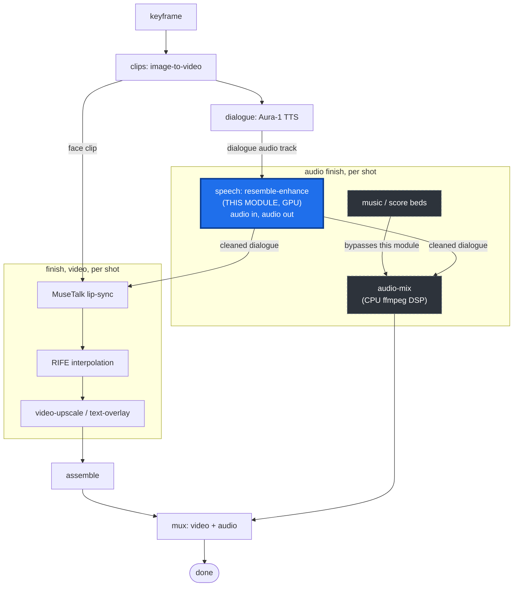

# vivijure-audio-upscale

[](https://github.com/skyphusion-labs/vivijure-audio-upscale/actions/workflows/build-image.yml)

> **Validated:** the image test-builds clean; the model loads and `enhance()` runs on CPU
> (bandwidth-extends 16 kHz -> 44.1 kHz). The full GPU `{"selftest": true}` harness is endpoint-gated
> (run once the RunPod endpoint is pinned -- a deliberate, spend-gated step).

A RunPod serverless image that enhances **speech** audio on GPU with
[resemble-enhance](https://github.com/resemble-ai/resemble-enhance) (denoise -> restore ->
bandwidth-extend). The CUDA half of Vivijure's audio finish path: it runs on a shot's **dialogue**
track **before** MuseTalk, so the lip-sync follows the cleaned audio and thin/auto-generated TTS
(Aura-1) comes out full and natural.

Speech only. Music / score beds go through the CPU `audio-mix` path (ffmpeg DSP "mastering"), not a
neural model -- cost-aware routing: GPU only when there's speech.

## Where it fits

This module is the **speech** node of Vivijure's finish chain. Two things to read off the diagram:
(1) it is **audio in, audio out** and runs **before** lip-sync, so MuseTalk drives the mouth from the
*cleaned* dialogue; (2) **music / score beds bypass it entirely** and take the CPU `audio-mix` path
-- the GPU only ever sees speech.



The video side of `finish` (MuseTalk lip-sync, then RIFE interpolation, then video-upscale /
text-overlay) is its own chain of single-purpose GPU modules; see the siblings
[`vivijure-musetalk`](https://github.com/skyphusion-labs/vivijure-musetalk) and
[`vivijure-upscale`](https://github.com/skyphusion-labs/vivijure-upscale).

## Models

resemble-enhance's checkpoints (the ResembleAI/resemble-enhance HF repo, ~713 MB) are baked into the
image at build via a `git-lfs` clone into the package's `model_repo`, so a cold worker never
re-downloads the weights. At startup the package does a cheap `git pull` (LFS-skipped) against the
already-baked repo, then loads.

## Job input

R2 mode (finish-chain module contract -- the endpoint reads/writes the shared bucket itself):

```json
{ "audio_key": "renders/<project>/dialogue/<shot>.wav", "output_key": "...optional...",
  "denoise": true, "nfe": 64, "lambd": 0.9, "tau": 0.5, "solver": "midpoint" }
```

Presigned mode (credentialless -- the caller presigns R2):

```json
{ "audio_url": "<presigned GET>", "output_url": "<presigned PUT>", "output_key": "..." }
```

Self-test (no R2 -- confirms CUDA, loads the model, enhances a generated clip end to end):

```json
{ "selftest": true }
```

Returns `{ ok, output_key, bytes, sr, applied: ["speech-upscale:resemble-enhance"] }` on success, or
`{ ok: false, error }` on failure. The handler **surfaces** failure (returns `ok:false`) -- it never
swallows it or silently passes the original through; the `applied` tag is set only on success, and
the orchestrator/router owns any soft-degrade policy. The transport contract and the self-test
harness mirror `vivijure-upscale`.

## License

This wrapper is licensed under **AGPL-3.0** (see `LICENSE`). Third-party components it incorporates
(resemble-enhance -- MIT; PyTorch / torchaudio -- BSD; FFmpeg) are listed in `THIRD_PARTY_NOTICES.md`.
